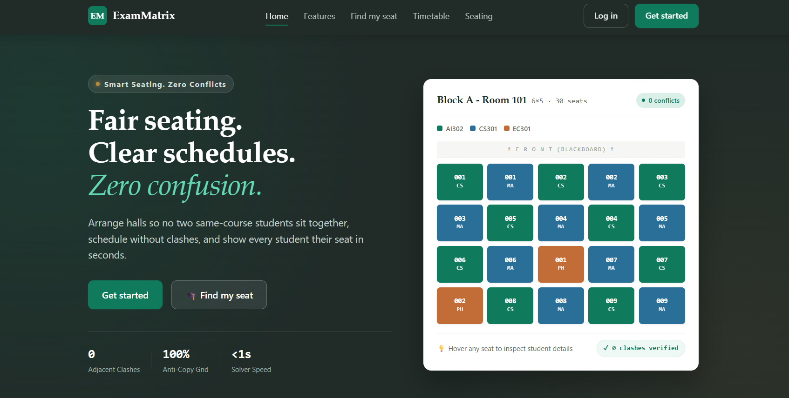
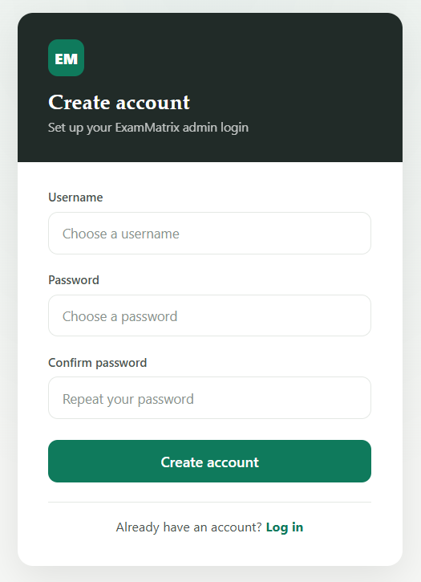
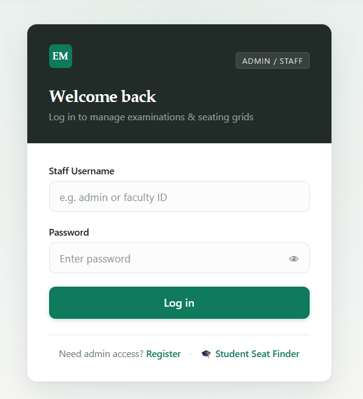
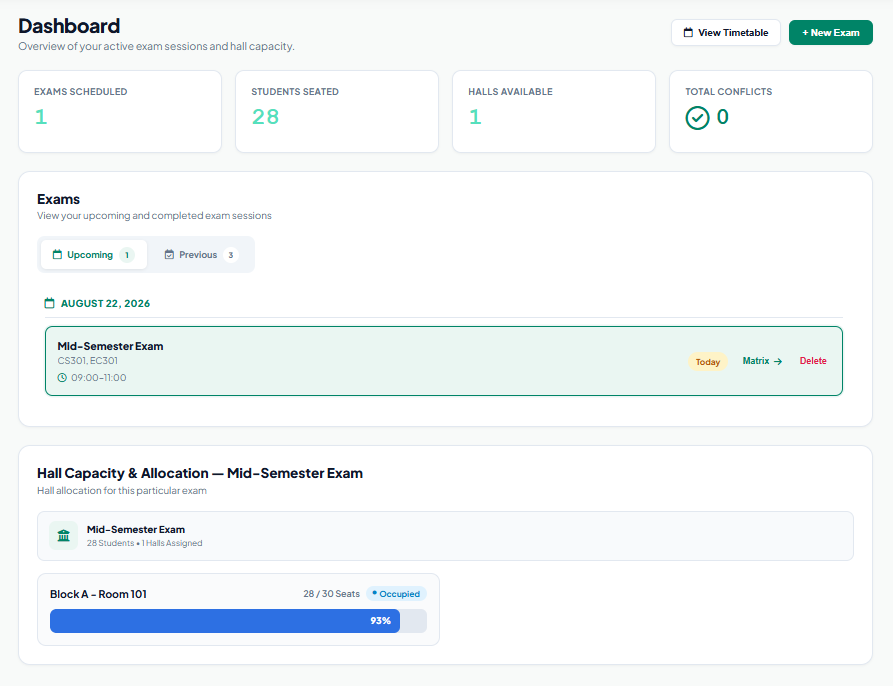
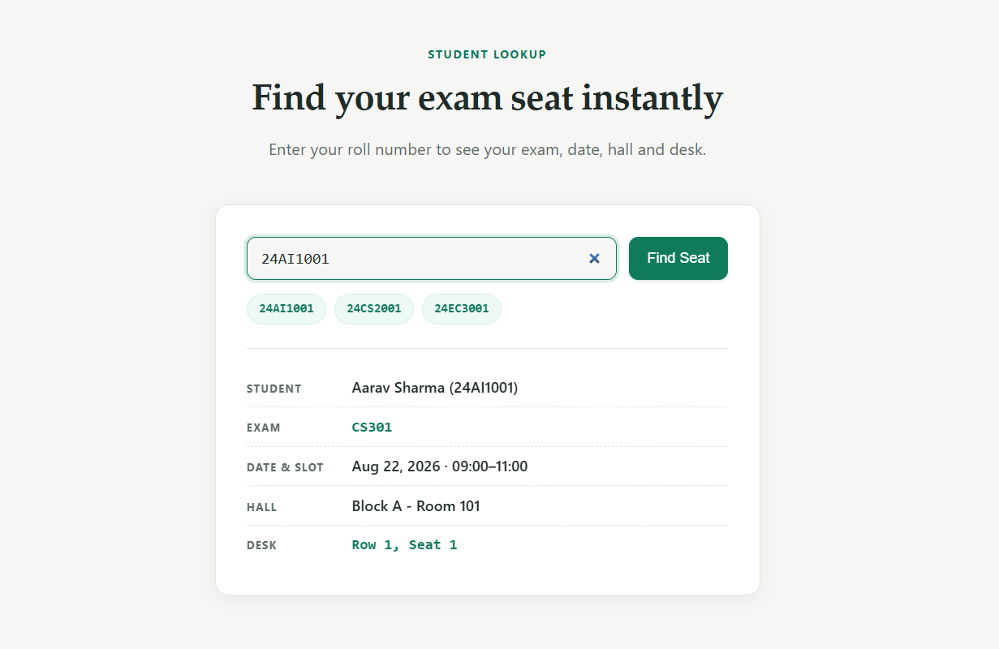
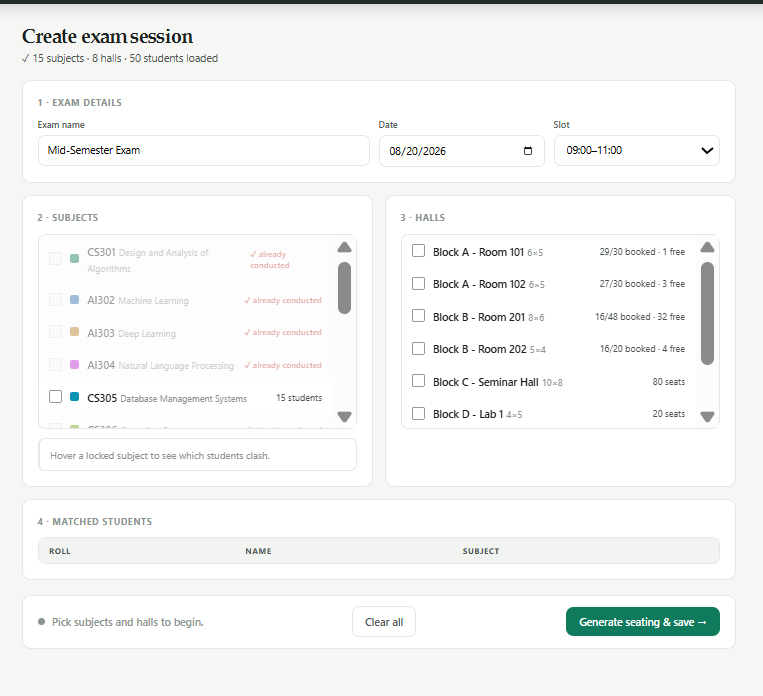
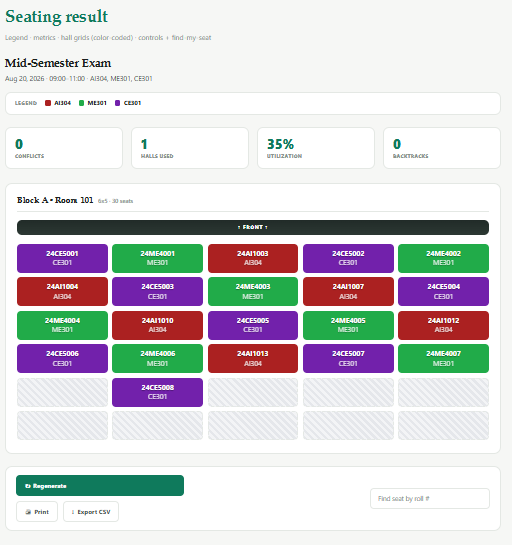
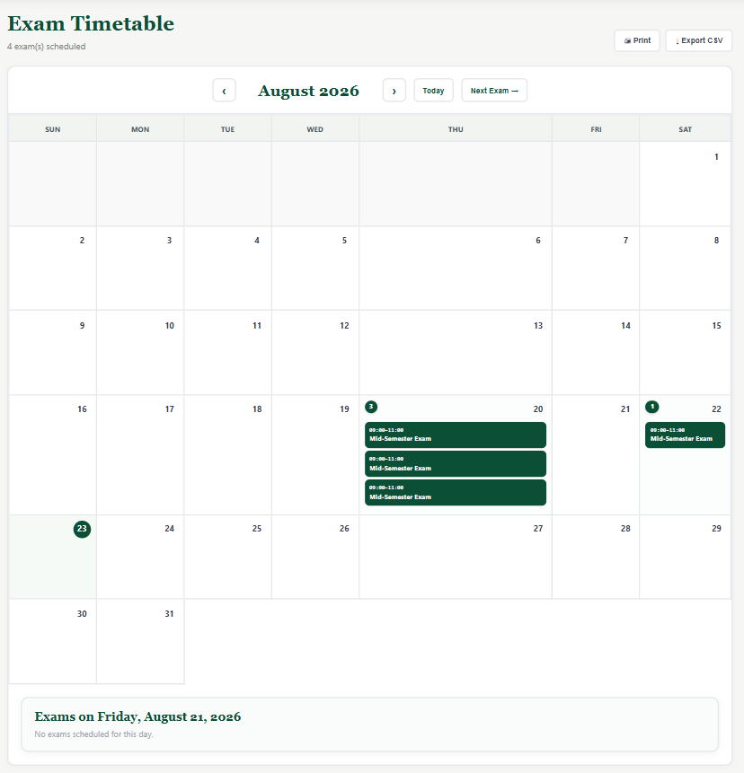

# 🎓 ExamMatrix

**ExamMatrix** is a web-based **Examination Management and Seating Allocation System** that automatically generates examination arrangements and organizes students into available examination halls.

The system uses information such as **students, subjects, examination requirements, and hall capacities** to generate organized exam schedules and seating arrangements, reducing the manual effort required for examination planning.

---

## ✨ Features

* 📅 **Exam Generation** — Generate examination schedules based on available subjects and requirements.
* 🏫 **Hall Allocation** — Allocate students to examination halls according to hall capacity.
* 🪑 **Seating Arrangement** — Generate and visualize student seating inside examination halls.
* 📊 **Dashboard** — View upcoming and previous examinations in one place.
* 👨‍🎓 **Student Management** — Manage student information used during exam generation.
* 📚 **Subject Management** — Maintain subjects used for examinations.
* 📈 **Exam Visualization** — View generated exams, hall allocation, and seating arrangements through clear visual representations.

---


## 🛠️ Technologies Used

* **HTML5**
* **CSS3**
* **JavaScript**
* **JSON**
* **Git & GitHub**

---

      
## 🚀 Getting Started

Clone the repository:

```bash
git clone https://github.com/I-Manmeet/ExamMatrix.git
```

Open the project in **VS Code** and run it using **Live Server**.

---

## 🎯 Objective

The objective of **ExamMatrix** is to automate and simplify examination planning by generating exams, allocating available halls, and organizing student seating in a structured and easy-to-understand way.

---
## 🔄 Project Workflow

ExamMatrix follows a structured workflow that manages the examination process from exam generation to student-specific examination information.

```text
┌─────────────────────────┐
│      🔐 LOGIN           │
│                         │
│  User Authentication    │
└────────────┬────────────┘
             │
             ▼
┌─────────────────────────┐
│      📊 DASHBOARD       │
│                         │
│  Examination Overview   │
└────────────┬────────────┘
             │
             ▼
┌─────────────────────────────────┐
│  📅 EXAM CREATION &             │
│     HALL ALLOCATION             │
│                                 │
│  Subject • Students             │
│  Date • Time • Semester         │
│  Hall Capacity • Allocation     │
└────────────┬────────────────────┘
             │
             ▼
┌─────────────────────────┐
│  🪑 SEATING ARRANGEMENT │
│                         │
│ Generate Student        │
│ Seating & Allocation    │
└────────────┬────────────┘
             │
             ▼
        ┌────┴────┐
        │         │
        ▼         ▼
┌──────────────┐  ┌──────────────────┐
│ 📅 TIMETABLE │  │ 🔎 FIND MY SEAT  │
│              │  │                  │
│ Exam Details │  │ Student Name     │
│ Subject      │  │ Exam Hall        │
│ Date         │  │ Assigned Seat    │
│ Time         │  │ Exam Information │
└──────┬───────┘  └────────┬─────────┘
       │                   │
       │                   │
       ▼                   ▼
┌──────────────┐   ┌──────────────────┐
│ 👨‍🎓 STUDENT  │   │ 👨‍🎓 STUDENT      │
│    VIEW      │   │      VIEW        │
│              │   │                  │
│ "WHEN IS     │   │ "WHERE DO I      │
│  MY EXAM?"   │   │  HAVE TO SIT?"   │
└──────────────┘   └──────────────────┘
```

### 🔹 Workflow Summary

**Index Page → Login/Register → Dashboard → Exam Creation & Hall Allocation → Seating Arrangement → Student Services**

ExamMatrix works by taking examination and student information, allocating students to available halls based on hall capacity, generating their seating arrangement, and then providing the final examination information to students.

### 🌐 1. Index Page

When the website is opened, the user first reaches the **ExamMatrix Index Page**, which introduces the system and provides access to the application.

### 🔐 2. Login / Register

The user logs in or registers to access the examination management system. After successful authentication, the user is redirected to the Dashboard.

### 📊 3. Dashboard

The Dashboard provides an overview of the examination system and allows the user to access the main examination management features.

### 📅 4. Exam Creation & Hall Allocation

Exam creation and hall allocation are handled together on the same page.
The user provides the examination details, including:

* Subject
* Students
* Date
* Time
* Semester
* Available examination halls

The system then allocates students to halls according to the **capacity of each hall**.
This step produces the basic examination and hall allocation data required for seating generation.

### 🪑 5. Seating Arrangement

Using the exam and hall allocation data, ExamMatrix generates the **student-specific seating arrangement**.

Thus, each student is connected to their examination, assigned hall, and specific seat.

### 👨‍🎓 6. Student Services

```text
                 👨‍🎓 STUDENT
                      │
          ┌───────────┴───────────┐
          │                       │
          ▼                       ▼
   📅 TIMETABLE              🔎 FIND MY SEAT
          │                       │
          ▼                       ▼
    What is my exam?       Where do I sit?
          │                       │
          ▼                       ▼
   Subject • Date • Time    Name • Hall • Seat
```

Once the examination and seating information has been generated, students can access their information through two services:

**📅 Timetable**
Students can view **what exam they have and when it is**, including the subject, date, time, and examination details.

**🔎 Find My Seat**
Students can find **where they have to sit**, including their name, assigned examination hall, and seat number.

### 🎯 In Simple Terms

> **ExamMatrix takes exam and student details → allocates students to halls → generates individual seats → provides the final exam and seating information to students.**

**Create Exam + Hall Allocation → Seating Generation → Student Information**
.


--- 

## 📸 Screenshots

### 🏠 Home Page



---

### 🔐 Signup & Login

<table>
  <tr>
    <td align="center">
      
    </td>
    <td align="center">
      
    </td>
  </tr>
</table>

---

### 📊 Dashboard



---

### 📊 Find My Seat



---

### 📅 Generated Exams & Hall Allocation



---

### 🪑 Seating Arrangement



---

### 📅 Timetable



---

## 🔮 Future Improvements

* **Secure Backend & Database Integration** — Store and manage exams, students, halls, and seating data securely using a centralized database.
* **Advanced & Automated Exam Scheduling**— Automatically schedule exams based on subjects, semesters, available halls, and time-slot constraints.
* **Optimized & Intelligent Seating Algorithms** — Improve seat allocation using smarter algorithms to reduce conflicts and utilize hall capacity efficiently.
* **Scalable Cloud-Based Deployment** — Deploy the system on cloud infrastructure to provide reliable access, scalability, and better performance.

---

## 👥 Contributors

* **I-Manmeet** — [@I-Manmeet](https://github.com/I-Manmeet)
* **Anupam** — [@Anupamshraddha](https://github.com/Anupamshraddha)
* **Jiya** — [@JiyaJindal3210](https://github.com/JiyaJindal3210)
---


