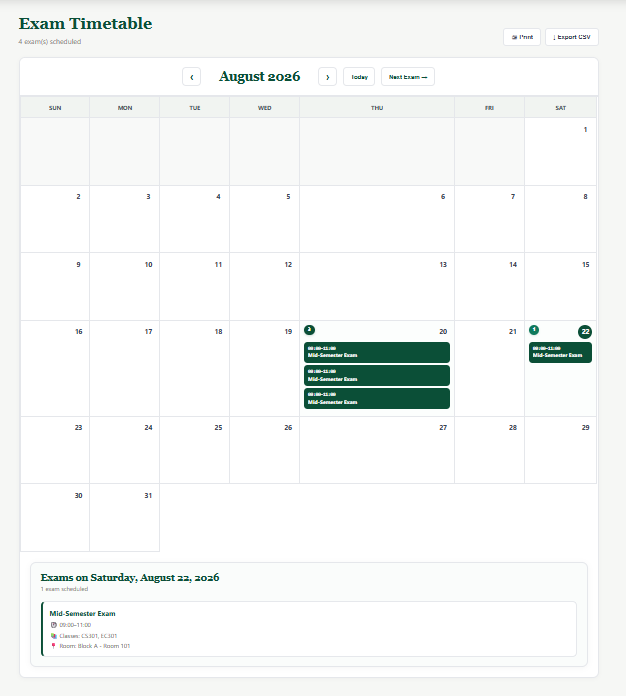

# 🎓 ExamMatrix

**ExamMatrix** is a web-based **Examination Management and Seating Allocation System** that automatically generates examination arrangements and organizes students into available examination halls.

The system uses information such as **students, subjects, examination requirements, and hall capacities** to generate organized exam schedules and seating arrangements, reducing the manual effort required for examination planning.

---

## ✨ Features

* 📅 **Exam Generation** — Generate examination schedules based on available subjects and requirements.
* 🏫 **Hall Allocation** — Allocate students to examination halls according to hall capacity.
* 🪑 **Seating Arrangement** — Generate and visualize student seating inside examination halls.
* 📊 **Dashboard** — View upcoming and previous examinations in one place.
* 👨‍🎓 **Student Management** — Manage student information used during exam generation.
* 📚 **Subject Management** — Maintain subjects used for examinations.
* 📈 **Exam Visualization** — View generated exams, hall allocation, and seating arrangements through clear visual representations.

---


## 🛠️ Technologies Used

* **HTML5**
* **CSS3**
* **JavaScript**
* **JSON**
* **Git & GitHub**

---

      
## 🚀 Getting Started

Clone the repository:

```bash
git clone https://github.com/I-Manmeet/ExamMatrix.git
```

Open the project in **VS Code** and run it using **Live Server**.

---

## 🎯 Objective

The objective of **ExamMatrix** is to automate and simplify examination planning by generating exams, allocating available halls, and organizing student seating in a structured and easy-to-understand way.

---
## 🔄 Project Workflow

ExamMatrix follows a structured workflow that manages the examination process from exam generation to student-specific examination information.

```text
┌─────────────────────────┐
│      🔐 LOGIN           │
│                         │
│  User Authentication    │
└────────────┬────────────┘
             │
             ▼
┌─────────────────────────┐
│      📊 DASHBOARD       │
│                         │
│  Examination Overview   │
└────────────┬────────────┘
             │
             ▼
┌─────────────────────────┐
│   📅 EXAM GENERATION    │
│                         │
│ Subject • Students      │
│ Date • Time • Semester  │
└────────────┬────────────┘
             │
             ▼
┌─────────────────────────┐
│   🏫 HALL ALLOCATION    │
│                         │
│ Allocate Students Based │
│ on Hall Capacity        │
└────────────┬────────────┘
             │
             ▼
┌─────────────────────────┐
│  🪑 SEATING ARRANGEMENT │
│                         │
│ Generate Student        │
│ Seating & Allocation    │
└────────────┬────────────┘
             │
             ▼
        ┌────┴────┐
        │         │
        ▼         ▼
┌──────────────┐  ┌──────────────────┐
│ 📅 TIMETABLE │  │ 🔎 FIND MY SEAT  │
│              │  │                  │
│ Exam Details │  │ Student Name     │
│ Subject      │  │ Exam Hall        │
│ Date         │  │ Assigned Seat    │
│ Time         │  │ Exam Information │
└──────┬───────┘  └────────┬─────────┘
       │                   │
       │                   │
       ▼                   ▼
┌──────────────┐   ┌──────────────────┐
│ 👨‍🎓 STUDENT  │   │ 👨‍🎓 STUDENT      │
│    VIEW      │   │      VIEW        │
│              │   │                  │
│ "WHEN IS     │   │ "WHERE DO I      │
│  MY EXAM?"   │   │  HAVE TO SIT?"   │
└──────────────┘   └──────────────────┘
```

### 🔹 Workflow Summary

**Login → Dashboard → Exam Generation → Hall Allocation → Seating Arrangement → Student Services**

From the generated examination data, students can access two important services:

* **📅 Timetable** → Students can view **what exam they have, the subject, date, time, and exam details**.
* **🔎 Find My Seat** → Students can view **their name, assigned examination hall, and seat information**.

### 👨‍🎓 Student Experience

```text
                 👨‍🎓 STUDENT
                      │
          ┌───────────┴───────────┐
          │                       │
          ▼                       ▼
   📅 TIMETABLE              🔎 FIND MY SEAT
          │                       │
          ▼                       ▼
    What is my exam?       Where do I sit?
          │                       │
          ▼                       ▼
   Subject • Date • Time    Name • Hall • Seat
```

This separates the two major student requirements:

> **Timetable answers: "When and what is my exam?"**
> **Find My Seat answers: "Where do I have to sit?"**

--- 

## 📸 Screenshots

### 🏠 Home Page


---

### 🔐 Signup & Login

<table>
  <tr>
    <td align="center">
      
    </td>
    <td align="center">
      
    </td>
  </tr>
</table>

---

### 📊 Dashboard


---

### 📅 Generated Exams & Hall Allocation


---

### 🪑 Seating Arrangement


---

### 📅 Timetable



---

## 🔮 Future Improvements

* Backend and database integration
* Advanced exam scheduling
* Optimized seating algorithms
* Cloud deployment

---

## 👥 Contributors

* **I-Manmeet** — [@I-Manmeet](https://github.com/I-Manmeet)
* **Anupam** — [@Anupamshraddha](https://github.com/Anupamshraddha)
* **Jiya** — [@JiyaJindal3210](https://github.com/JiyaJindal3210)
---


